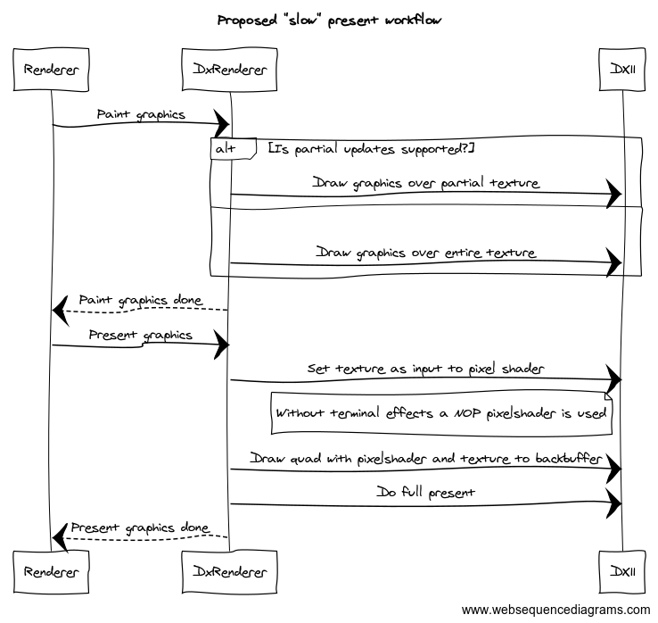

# Support renderer fast presents

## Abstract

The current renderer has a complex workflow in order to render a frame. If one are looking into providing animated backgrounds or terminal effects that require high FPS rates the process is too slow especially since terminal effects disables partial (faster) repaints.

In addition; in `DxRenderer.cpp` there is lot of copying back-n-forth between forward and back buffer to enable partial updates and terminal effects.

This proposal aims to:

1. Allow fast presents (60+ FPS) for renderers where it makes sense.
2. Enable partial updates even if terminal effects are enabled.
3. Simplify and speed up `DxRenderer`.

## Considerations

N/A

## Solution Design

Proposes to have two seperate workflows for presenting graphics.

1. "Slow" present workflow (draws all the graphics)
2. "Fast" present workflow (only applies terminal effects to cached graphics)

### Current "slow" present workflow

This is the current workflow.

The problem here is that there is no way to apply a terminal effect twice with different parameters as we use the backbuffer as input and render to the backbuffer which will create interesting but undesirable feedback effects. This is also the reason partial rendering is disabled when using terminal effects.

This means that the current workflow can't support a fast present workflow nor partial rendering with terminal effects.

### Proposed "slow" present workflow

Instead of drawing directly to the DXGI backbuffer `DxRenderer` creates a texture with the correct dimensions and does all rendering there.

When presenting a pixelshader is always applied when rendering the texture to the backbuffer. Without terminal effects a special "NOP" pixelshader is used.

With this approach the terminal effects isn't rendered to the texture holding the terminal graphics meaning there is no feedback mechanism and that it is possible to support partial rendering with terminal effects.

In addition; the workflow is somewhat simpler.

### Proposed "fast" present workflow

Even with the partial rendering supported the "slow" workflow is too slow to render at 60 FPS. Therefore a "fast" present workflow is introduced

The "fast" present workflow is invoked at a predetermined rate, usually 60 FPS.

This will allow for lingering CRT effects or animated starfields and so on running in windows terminal. Kind of useless but cool.

## UI/UX Design

_(no change expected)_

## Capabilities

### Accessibility

_(no change expected)_

### Security

_(no change expected)_

### Reliability

_(no change expected)_

### Compatibility

Uses a larger footprint of DX11. The pixelshader could be made optional and we instead just copy the texture resource to the backbuffer on present when no terminal effects.

### Performance, Power, and Efficiency

Potential memory increase when as a texture is always created.

## Potential Issues

_(no change expected)_

## Future considerations

Mip map levels on textures could be enabled for more advanced CRT effects such as gaussian blur. Mip map levels can help as the gaussian blur can be applied on a lower resolution mip map layer to avoid applying a large blur kernel which is very expensive even though GPUs are fast. Gaussian blur can be used to create effects like glowing characters.

## Resources

### Implementation proposal

https://github.com/mrange/terminal/tree/mrange/shaderificIII

Has several issues but "works":

1. Scroll invalidate does a full invalidate. Fixable by scrolling the texture rather than the backbuffer
2. "Fast" present workflow just "hacked" into the main windows loop without much thought.
3. Pixelshader is always applied (without terminal effects we should just copy the resource)

